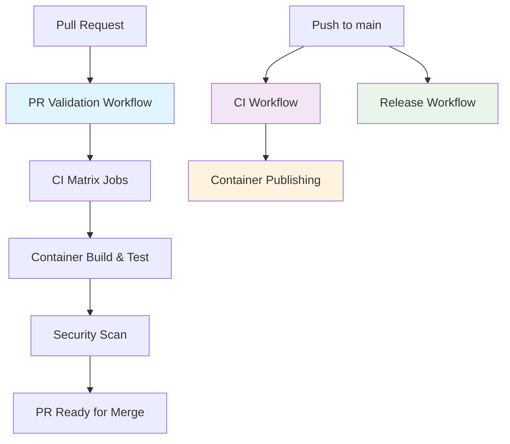

# template_python_project

[](https://github.com/engineeringclouds/template_python_project/actions/workflows/ci.yml)
[](https://github.com/engineeringclouds/template_python_project/actions/workflows/pr-validation.yml)
[](https://github.com/engineeringclouds/template_python_project/actions/workflows/container.yml)
[](https://github.com/engineeringclouds/template_python_project/actions/workflows/release.yml)
[](LICENSE)
[](https://www.python.org/downloads/)
[](https://pre-commit.com/)
[](https://hub.docker.com/)
[](CODE_OF_CONDUCT.md)

A minimal, secure, and modern Python project template with a basic Hello World app, containerization support, and robust development tooling.

## Development Philosophy

This template was collaboratively developed through "vibe coding" - an iterative, conversation-driven approach using AI assistance where the project evolved organically based on real needs and best practices. Rather than following a rigid specification, we built this template through continuous refinement, testing, and improvement in an interactive dialogue, ensuring it provides genuine value for Python developers starting new projects.

## Features

-   Python 3.13+ compatible
-   Minimal Hello World application
-   Containerization with Docker
-   Pre-commit hooks and code style enforcement (Black, Ruff, Mypy)
-   Bootstrap scripts for easy setup (Linux/macOS and Windows)
-   Security best practices (see below)
-   Well-documented and easy to use

## Security Best Practices

-   Uses virtual environments for dependency isolation
-   No secrets or sensitive data in code or config
-   `.gitignore` excludes common sensitive files and folders
-   Container runs as non-root by default (see Dockerfile for customization)
-   Dependencies managed via `pyproject.toml` for reproducibility
-   Pre-commit hooks help catch common mistakes before code is committed

## Getting Started

<details>
<summary>💻 <strong>Local Development Setup</strong></summary>

### Quick Start

1. **Clone the repository:**

    ```sh
    git clone https://github.com/engineeringclouds/template_python_project.git
    cd template_python_project
    ```

2. **Bootstrap your environment:**

    **Linux/macOS:**

    ```sh
    ./scripts/bootstrap.sh
    ```

    **Windows (PowerShell):**

    ```powershell
    .\scripts\bootstrap.ps1
    ```

3. **Run the application:**
    ```sh
    python -m template_python_project
    ```

</details>

<details>
<summary>🐳 <strong>Container Setup</strong></summary>

### Docker Quick Start

1. **Build the image:**

    ```sh
    docker build -t template-python-project .
    ```

2. **Run the container:**
    ```sh
    docker run --rm template-python-project
    ```

</details>

<details>
<summary>🧪 <strong>Testing</strong></summary>

### Run Tests

```sh
pytest
```

### Run with Coverage

```sh
pytest --cov --cov-report=html
```

</details>

## Example Output

When you run the application, you should see:

```sh
$ python -m template_python_project
Hello, world!
```

## 📚 Usage Examples

<details>
<summary>🚀 <strong>Creating a New Project from This Template</strong></summary>

### Method 1: GitHub Template (Recommended)

1. Click [**Use this template**](https://github.com/engineeringclouds/template_python_project/generate)
2. Choose a repository name (e.g., `my-awesome-project`)
3. Clone your new repository:
    ```sh
    git clone https://github.com/yourusername/my-awesome-project.git
    cd my-awesome-project
    ```

### Method 2: Manual Setup

```sh
# Download and extract template
curl -L https://github.com/engineeringclouds/template_python_project/archive/main.zip -o template.zip
unzip template.zip
mv template_python_project-main my-awesome-project
cd my-awesome-project

# Initialize as new git repository
rm -rf .git
git init
git add .
git commit -m "Initial commit from template"
```

</details>

<details>
<summary>🔧 <strong>Customizing the Template</strong></summary>

### Rename the Package

1. **Update directory structure:**

    ```sh
    mv src/template_python_project src/my_package_name
    ```

2. **Update pyproject.toml:**

    ```toml
    [project]
    name = "my-package-name"
    # ... other settings
    ```

3. **Update imports and references:**
    ```python
    # In src/my_package_name/__main__.py
    from my_package_name.main import main
    ```

### Add Your Own Functionality

```python
# src/my_package_name/main.py
def hello(name: str = "world") -> str:
    """Generate a personalized greeting."""
    return f"Hello, {name}!"

def main():
    import sys
    name = sys.argv[1] if len(sys.argv) > 1 else "world"
    print(hello(name))
```

</details>

<details>
<summary>🔄 <strong>Development Workflow Examples</strong></summary>

### Daily Development

```sh
# Activate environment
source .venv/bin/activate  # or .\.venv\Scripts\Activate.ps1 on Windows

# Make changes to your code
# ...

# Run quality checks
pre-commit run --all-files

# Run tests with coverage
pytest --cov

# Build and test container
docker build -t my-project .
docker run --rm my-project
```

### Release Workflow

```sh
# Make changes using conventional commits
git commit -m "feat: add user authentication system"
git commit -m "fix: resolve memory leak in data processing"
git commit -m "docs: update installation instructions"

# Push to main branch (triggers automatic release)
git push origin main
```

### Manual Release

Use GitHub Actions workflow dispatch with options:

-   **Force version bump:** patch, minor, major, prerelease
-   **Create prerelease:** For testing unreleased features
-   **Dry run:** Test release process without creating actual release

</details>

<details>
<summary>🧪 <strong>Testing Examples</strong></summary>

### Basic Testing

```python
# tests/test_my_feature.py
import pytest
from my_package_name import my_function

def test_my_function():
    """Test basic functionality."""
    result = my_function("input")
    assert result == "expected_output"

def test_my_function_edge_case():
    """Test edge case handling."""
    with pytest.raises(ValueError):
        my_function(None)
```

### Running Different Test Scenarios

```sh
# Run all tests
pytest

# Run specific test file
pytest tests/test_my_feature.py

# Run with coverage report
pytest --cov --cov-report=html

# Run performance tests only
pytest -m performance

# Run tests in parallel
pytest -n auto
```

</details>

<details>
<summary>🐳 <strong>Container Usage Examples</strong></summary>

### Development Container

```sh
# Build development image with test dependencies
docker build -f Dockerfile.dev -t my-project-dev .

# Run container with volume mounting for live development
docker run -v $(pwd):/app -it my-project-dev bash
```

### Production Container

```sh
# Build optimized production image
docker build -t my-project:latest .

# Run with environment variables
docker run -e MY_CONFIG_VAR=value my-project:latest

# Run with specific port mapping
docker run -p 8080:8080 my-project:latest
```

### Multi-stage Build Example

```dockerfile
# Add to your Dockerfile for optimized builds
FROM python:3.13-slim as builder
WORKDIR /build
COPY pyproject.toml .
RUN pip install build && python -m build

FROM python:3.13-slim as runtime
COPY --from=builder /build/dist/*.whl .
RUN pip install *.whl
CMD ["python", "-m", "my_package_name"]
```

</details>

## GitHub Repository Configuration

This template includes automated GitHub repository configuration to set up optimal open source project settings.

### Automated Setup

Run the configuration script to automatically configure your repository:

```sh
# Make the script executable
chmod +x scripts/configure-github-repo.sh

# Configure your repository
./scripts/configure-github-repo.sh

# Or configure a different repository
./scripts/configure-github-repo.sh your-username/your-repo
```

### What Gets Configured

-   **Repository Settings**: Description, topics, discussions, wiki, template status
-   **Labels**: Comprehensive label system for issues and PRs
-   **Branch Protection**: Protects main branch with required status checks
-   **Community Health**: Verifies presence of all community health files

### Prerequisites

1. Install [GitHub CLI](https://cli.github.com/): `brew install gh` (macOS) or see [installation guide](docs/github-cli-reference.md)
2. Authenticate: `gh auth login`

For detailed information, see:

-   [GitHub Configuration Guide](docs/github-configuration.md)
-   [GitHub CLI Reference](docs/github-cli-reference.md)

## Troubleshooting

<details>
<summary>🐛 <strong>Common Issues</strong></summary>

### Test Import Errors

**Problem:** `ModuleNotFoundError` when running tests
**Solution:** Ensure pytest configuration is correct:

```sh
# Method 1: Use pytest with proper path
PYTHONPATH=src pytest

# Method 2: Check pyproject.toml has:
# [tool.pytest.ini_options]
# pythonpath = ["src"]
```

### Virtual Environment Issues

**Problem:** Bootstrap scripts fail or Python not found
**Solutions:**

```sh
# Check Python version
python --version  # Should be 3.13+

# Manual environment setup
python -m venv .venv
# Linux/macOS:
source .venv/bin/activate
# Windows:
.\.venv\Scripts\Activate.ps1

# Install dependencies
pip install -e ".[dev]"
```

### Container Build Failures

**Problem:** Docker build fails or image won't run
**Solutions:**

```sh
# Check Docker is running
docker --version

# Clean build (no cache)
docker build --no-cache -t template-python-project .

# Debug build process
docker build -t template-python-project . --progress=plain

# Check logs
docker logs <container-id>
```

### GitHub Actions Failures

**Problem:** CI/CD workflows fail
**Common causes:**

-   Missing secrets or environment variables
-   Workflow file syntax errors
-   Permission issues with GITHUB_TOKEN
-   Dependency conflicts

**Debug steps:**

1. Check workflow logs in GitHub Actions tab
2. Verify all required secrets are configured
3. Test workflow locally with `act` (if available)
4. Compare with working template version

</details>

### Security Note

For production use, remember to:

-   Remove placeholder files like `.venv/.gitkeep`
-   Update URLs in `pyproject.toml` to match your project
-   Review and update the security practices for your specific use case
-   Consider using `pip-audit` to check for known security vulnerabilities:
    ```sh
    pip install pip-audit
    pip-audit
    ```

## CI/CD Pipeline

This project uses GitHub Actions with a robust, optimized CI/CD pipeline designed for reliability and maintainability.

> 📖 **Detailed Architecture**: See [Workflow Architecture Documentation](docs/workflow-architecture.md) for comprehensive implementation details.

### Workflow Dependencies

<details>
<summary>📱 <strong>View Workflow Diagram</strong></summary>



</details>

**Pull Request Validation:**

1. **PR Validation Workflow** (`pr-validation.yml`) - Comprehensive validation using `needs` keyword

    - **CI Matrix**: Cross-platform testing (Ubuntu, Windows, macOS)
        - Linting with Ruff
        - Code formatting check with Black
        - Type checking with MyPy
        - Testing with pytest
    - **Container Job**: Docker build and testing (depends on CI success)
    - **Security Scan**: Trivy vulnerability scanning (depends on container success)

**Main Branch Automation:**

2. **CI Workflow** (`ci.yml`) - Post-merge validation

    - Runs comprehensive testing after merge to main

3. **Container Publishing** (`container.yml`) - Production image builds

    - **Dependency**: Triggered by successful CI workflow completion
    - Builds and publishes container images to registry

4. **Release Workflow** (`release.yml`) - Automated semantic versioning
    - **Trigger**: Pushes to main branch or manual dispatch
    - Analyzes conventional commits for version bumps
    - Generates changelogs and creates GitHub releases
    - Validates template functionality

### Key Benefits

-   **Reliable Dependencies**: Uses GitHub's native `needs` keyword instead of complex cross-workflow polling
-   **Fast Feedback**: Parallel job execution with proper dependency ordering
-   **Branch Protection**: Required status checks prevent merge until all validations pass
-   **Clear Separation**: Distinct workflows for PR validation vs. production automation

This ensures that only validated, tested code gets containerized and released, following the fail-fast principle and optimizing resource usage.

### Automated Template Releases

The project uses [semantic versioning](https://semver.org/) with [conventional commits](https://www.conventionalcommits.org/) to manage template releases:

-   `feat:` → Minor version bump (0.1.0 → 0.2.0) - New template features
-   `fix:` → Patch version bump (0.1.0 → 0.1.1) - Template fixes
-   `feat!:` or `BREAKING CHANGE:` → Major version bump (0.1.0 → 1.0.0) - Breaking changes

Each release validates that the template produces working Python projects and provides clear upgrade paths for existing users.

See [Release Workflow Guide](docs/release-workflow.md) for detailed information.

## Documentation

-   See [CONTRIBUTING.md](CONTRIBUTING.md) for contribution guidelines
-   See [Release Workflow Guide](docs/release-workflow.md) for automated release information
-   See [Usage Examples](docs/examples.md) for detailed implementation examples
-   See [GitHub Configuration Guide](docs/github-configuration.md) for repository setup
-   See [GitHub CLI Reference](docs/github-cli-reference.md) for CLI automation
-   See [CHANGELOG.md](CHANGELOG.md) for release history
-   See [LICENSE](LICENSE) for license details

## Project URLs

-   [Homepage](https://github.com/engineeringclouds/template_python_project)
-   [Documentation](https://engineeringclouds.github.io/template_python_project/)
-   [Source](https://github.com/engineeringclouds/template_python_project)
-   [Tracker](https://github.com/engineeringclouds/template_python_project/issues)

## Contributing

We welcome contributions! This project embodies a collaborative "vibe coding" philosophy - we believe the best solutions emerge through iterative conversation and real-world testing, whether that's human-to-human or human-to-AI collaboration. Whether you're suggesting improvements, fixing bugs, or adding features, we value the collaborative process of building something useful together.

Please see [CONTRIBUTING.md](CONTRIBUTING.md) for guidelines.

Please note that this project is released with a [Contributor Code of Conduct](CODE_OF_CONDUCT.md). By participating in this project you agree to abide by its terms.

## License

This project is licensed under the [MIT License](LICENSE).
