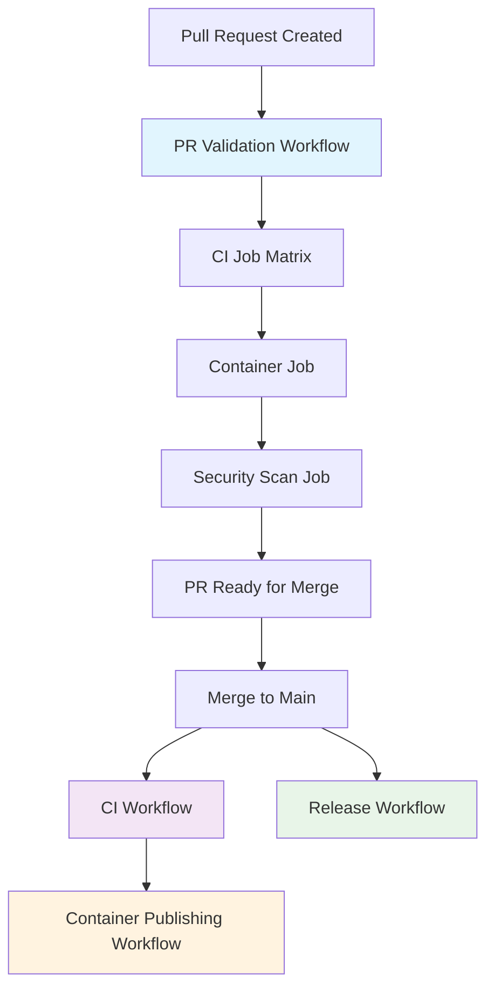

# Workflow Dependency Architecture

This repository uses a clean, reliable workflow dependency structure optimized for GitHub Actions best practices.

## Workflow Structure

### 1. PR Validation (`pr-validation.yml`)

**Trigger**: Pull requests to `main` branch
**Purpose**: Comprehensive validation before merge

**Execution Flow**:

```
ci (matrix: ubuntu/windows/macos) → container → security-scan
```

-   **CI Job**: Runs tests, linting, type checking across multiple OS platforms
-   **Container Job**: Builds and tests Docker image (depends on CI success)
-   **Security Scan Job**: Runs Trivy vulnerability scanning (depends on container success)

**Key Benefits**:

-   Uses `needs` keyword for reliable job dependencies within single workflow
-   All PR checks must pass before merge is allowed
-   Clear, linear dependency chain with proper error handling

### 2. Main Branch CI (`ci.yml`)

**Trigger**: Push to `main` branch
**Purpose**: Comprehensive testing after merge

**Execution Flow**:

```
test (matrix: ubuntu/windows/macos)
```

### 3. Container Publishing (`container.yml`)

**Trigger**: After CI workflow completes successfully on `main`
**Purpose**: Build and publish production container images

**Execution Flow**:

```
check-ci-success → build-and-publish
```

### 4. Release Management (`release.yml`)

**Trigger**: Push to `main` or manual dispatch
**Purpose**: Automated semantic versioning and GitHub releases

## Why This Architecture?

### Problems with Cross-Workflow Dependencies

The original implementation used `workflow_run` triggers with complex wait logic, which had several issues:

1. **Reliability**: `workflow_run` triggers have limitations and don't work consistently across branches
2. **Complexity**: Required complex API polling and timeout logic
3. **Debugging**: Difficult to troubleshoot when workflows don't trigger as expected
4. **Race Conditions**: Timing issues between workflow completion and trigger events

### Benefits of Current Approach

1. **Reliability**: Uses GitHub's native `needs` keyword for job dependencies
2. **Simplicity**: Clean, declarative dependencies without custom wait logic
3. **Performance**: Faster execution with proper job parallelization
4. **Maintainability**: Easier to understand and modify
5. **Status Checks**: Automatic PR status check integration

## Branch Protection Configuration

Configure the following required status checks in your repository settings:

### Required Status Checks for `main` branch:

-   `PR Validation / ci (ubuntu-latest)`
-   `PR Validation / ci (windows-latest)`
-   `PR Validation / ci (macos-latest)`
-   `PR Validation / container`
-   `PR Validation / security-scan`

This ensures that:

-   All PR validation jobs must pass before merge
-   PRs cannot be merged if any workflow step fails
-   Container and security scanning are automatically validated

## Workflow Dependencies Diagram



This architecture provides robust, reliable workflow orchestration that scales well and is easy to maintain.

## Automated Repository Configuration

The repository includes automated setup scripts that configure branch protection rules to enforce this workflow architecture:

### Branch Protection Automation

The `scripts/configure-github-repo.sh` script automatically configures:

-   **Required status checks** for all PR validation jobs
-   **Branch protection rules** that prevent direct pushes to main
-   **Merge restrictions** requiring PR validation to pass

### Required Status Checks

The following status checks are automatically configured as required:

-   `PR Validation / ci (ubuntu-latest)`
-   `PR Validation / ci (windows-latest)`
-   `PR Validation / ci (macos-latest)`
-   `PR Validation / container`
-   `PR Validation / security-scan`

This ensures that the workflow dependency architecture is properly enforced at the repository level.

> 📖 See [GitHub Configuration Guide](github-configuration.md) for detailed setup instructions.
